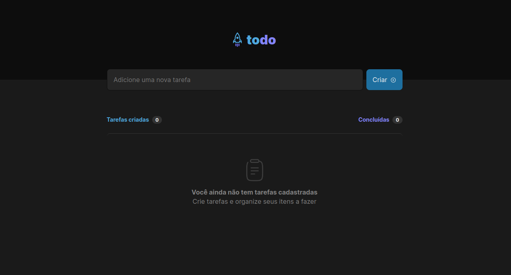
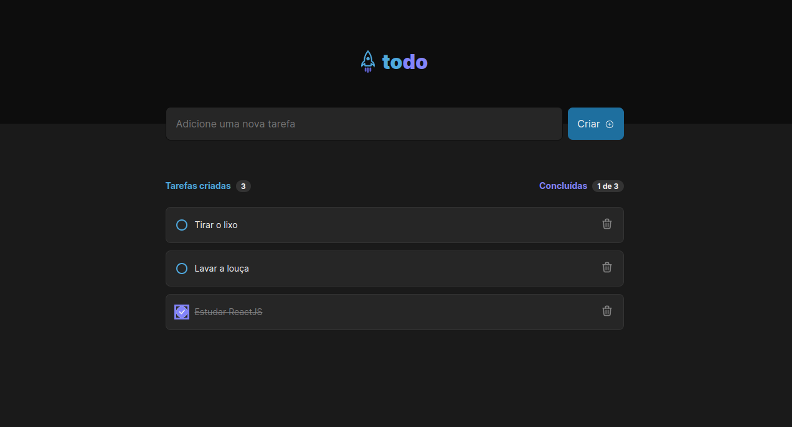

<p align="center">
   
</p>

<p align="center">
   <a href="https://www.linkedin.com/in/jeanknieling" target="_blank">
      
   </a>
</p>

> Primeiro desafio da trilha atualizada de React no Ignite da [Rocketseat](https://www.rocketseat.com.br/). O projeto consiste em adicionar, marcar e remover tarefas.

# 📌 Conteúdo

- [📌 Conteúdo](#-conteúdo)
- [🔗 Link do projeto rodando no Vercel](#-link-do-projeto-rodando-no-vercel)
- [📸 Screenshots do projeto](#-screenshots-do-projeto)
- [💻 Tecnologias](#-tecnologias)
- [🧑‍💻 Executando](#-executando)
- [🧑‍💻 Autores](#-autores)
- [📓 Licença](#-licença)

# 🔗 Link do projeto rodando no Vercel
[https://rocketseat-ignite-01-desafio-to-do-list.vercel.app/](https://rocketseat-ignite-01-desafio-to-do-list.vercel.app/)

# 📸 Screenshots do projeto

<div>
   
   
</div>


# 💻 Tecnologias

Este projeto foi feito utilizando as seguintes tecnologias:

- [React](https://reactjs.org/)
- [React DOM](https://pt-br.reactjs.org/docs/react-dom.html)
- [Typescript](https://www.typescriptlang.org/)
- [Vite](https://vitejs.dev/)
- [CSS Module](https://github.com/css-modules/css-modules)
- [UUID](https://github.com/uuidjs/uuid#readme)
- [React Icons](https://react-icons.github.io/react-icons/)

# 🧑‍💻 Executando

```bash
# Clone o Repositório
$ git clone https://github.com/jeanknieling/rocketseat-ignite
```

```bash
# Navegue até a pasta correta
$ cd rocketseat-ignite/react-trilha-atualizada/01-desafio-to-do-list
```

```bash
# Baixe as dependendências
$ yarn
```

```bash
# Execute
$ yarn dev
```

Acesse <http://localhost:3000> para ver o resultado.

# 🧑‍💻 Autores

<table>
  <tr>
    <td align="center">
        <a href="https://github.com/jeanknieling/" target="_blank">
            
            <br />
            <sub>
            <b>Jean Knieling</b>
            </sub>
        </a>
       <br />
       <a href="https://www.linkedin.com/in/jeanknieling/" title="Linkedin Jean Knieling" target="_blank">@jeanknieling</a>
       <br />
       💻
    </td>
    <td align="center">
        <a href="https://github.com/rocketseat" target="_blank">
            
            <br />
            <sub>
            <b>Rocketseat</b>
            </sub>
        </a>
        <br />
        <a href="https://www.linkedin.com/school/rocketseat/" title="Linkedin Rocketseat" target="_blank">@Rocketseat</a>
        <br />
        🚀
    </td>
  </tr>
</table>

# 📓 Licença

Este projeto está sob a licença [MIT](./LICENSE).
<br/>

